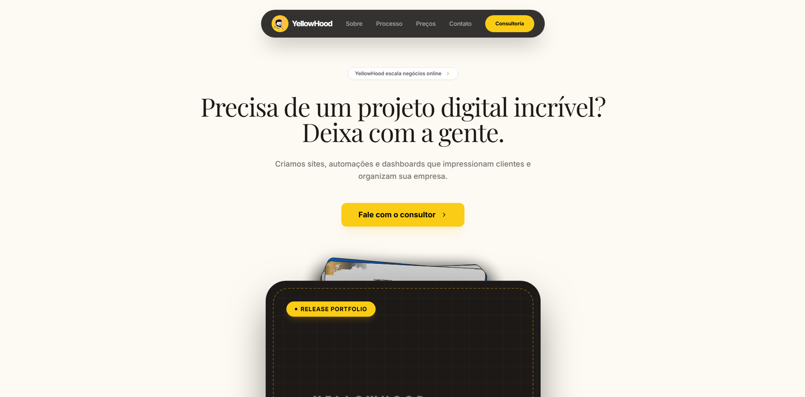

<!-- HEADER_START -->

<table>
  <tr>
    <td valign="top" width="50%">
      <h2>Hi there, I'm Gabriel 👋</h2>
      
Currently working as a <b>Researcher</b> and focusing on my <b>Master's degree</b>. In my free time, I focus on <b>personal projects</b> and exploring the entrepreneurial world with a <b>company</b> and a <b>micro SaaS</b>.

       
       
      
      <!-- Blog -->
      👉 
      
       
       

      <!-- Socials -->
      
      
      
      
       
       

      <!-- Stack -->
      <b>Stack > </b>
      
      
      
      
      
    </td>
    <td valign="center" width="50%" align="center">
      
       
      Latest Photo from Blog
    </td>
  </tr>
</table>

<!-- HEADER_END -->

### Blog Updates

<ul>
<!-- PORTFOLIO_START -->
<li><a href="https://a-new-type-portifolio.vercel.app/#/detail/feed/from-st-augustine-to-personal-blogging-how-i-found-my-own-catharsis-3492" target="_blank">From St. Augustine to Personal Blogging: How I Found My Own Catharsis</a> - 2026-01-18 • </li>
<li><a href="https://a-new-type-portifolio.vercel.app/#/photos" target="_blank">This book was my first step on Camus work.</a> - 2026-01-18 • </li>
<li><a href="https://a-new-type-portifolio.vercel.app/#/photos" target="_blank">Testing pixel-logo for my SaaS</a> - 2026-01-15 • </li>
<li><a href="https://a-new-type-portifolio.vercel.app/#/detail/feed/-super-busy-with-project-2026-8426" target="_blank"># Super Busy with Project 2026</a> - 2026-01-10 • </li>
<li><a href="https://a-new-type-portifolio.vercel.app/#/leetcode/dc8e8357-1502-4d37-8e60-60d8b40f0605" target="_blank">#1161: Maximum Level Sum of a Binary Tree</a> - 2026-01-06 • </li>
 
<li><a href="BLOG_HISTORY.md">... See all old posts</a></li>
<!-- PORTFOLIO_END -->
</ul>

### TabNews

> ⚠️ **Disclaimer:** These posts are in Portuguese. English versions are available on my [personal blog](https://a-new-type-portifolio.vercel.app/)!

<ul>
<!-- TABNEWS_START -->
<li><a href="https://www.tabnews.com.br/gabrielbaiano/muito-alem-do-readme-o-que-voce-provavelmente-nao-sabia-sobre-documentacao-no-github" target="_blank">Muito além do README: O que você (provavelmente) não sabia sobre documentação no GitHub</a> - 2025-12-01 </li>
<li><a href="https://www.tabnews.com.br/gabrielbaiano/utilidade-publica-sobre-documentacao-e-repositorios" target="_blank">Utilidade publica sobre documentação e repositórios!</a> - 2025-10-07 </li>
<li><a href="https://www.tabnews.com.br/gabrielbaiano/do-bloqueio-a-arte-por-que-a-criatividade-e-a-habilidade-tecnica-que-voce-esta-ignorando" target="_blank">Do Bloqueio à Arte: Por que a Criatividade é a Habilidade Técnica que Você Está Ignorando</a> - 2026-01-02 </li>
 
<li><a href="TABNEWS_HISTORY.md">... See all old posts</a></li>
<!-- TABNEWS_END -->
</ul>

### Books I'm Reading

<!-- BOOKS_START -->

  This is part of my <b><a href="https://github.com/GabrielBaiano/personal-library">Personal Library</a></b> project — a dedicated space where I organize my readings, share reflections, and build a consistent reading habit.

<table>
    <tr>
      <th colspan="3">Reading</th>
    </tr>
<!-- READING_START -->
<tr>
      <td align="center">
        
         
        
         
        <a href="https://www.google.com.br/books/edition/Funda%C3%A7%C3%A3o/x8quCgAAQBAJ?hl=pt-BR&gbpv=1&dq=funda%C3%A7%C3%A3o+isaac+asimov&printsec=frontcover"><b>Fundação</b></a> BR
         
        Status: <b>Reading 📖</b>
      </td>
      <td align="center">
        
         
        
         
        <a href="https://www.google.com.br/books/edition/The_Family/ldPIxgRaEuoC?hl=pt-BR&gbpv=1&dq=the+family+book+mario+puzo&pg=PT1&printsec=frontcover"><b>Os Bórgias</b></a> BR
         
        Status: <b>Reading 📖 </b>
      </td>
      <td align="center">
        
         
        
         
        <a href="https://www.google.com.br/books/edition/Entendendo_Algoritmos/HWewDgAAQBAJ?hl=pt-BR&gbpv=1&dq=algoritmo+livro&printsec=frontcover"><b>Entendendo Algoritmos</b></a> BR
         
        Status: <b>Reading 📖</b>
      </td>
    </tr>
<!-- READING_END -->
  </table>

 

**2026 Reading Progress:** 2 books read so far 🏁
 
<a href="https://github.com/GabrielBaiano/personal-library">Check out my specific notes here!</a>

<!-- BOOKS_END -->
 
<!-- READING_START -->
<!-- READING_END -->
 

 

  
<b>👇 My other projects and repo</b>

   

**Handbook** | **Homepage** | **Stars** | **Downloads**
:--- | --- | :--- | :---
[awesome-readme](https://github.com/GabrielBaiano/awesome-readme) | [Homepage](https://awesome-readme-nu.vercel.app/) |  | 

 
 

  <h3>★ Special thanks to ★</h3>
   
  
   
  <a href="https://www.yellowhood.com.br">YellowHood Agency</a>

