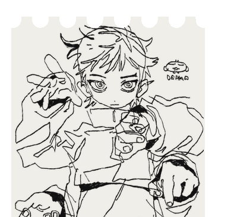
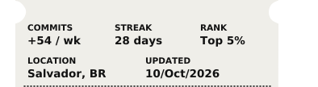

<table>
  <tr>
    <td width="400" valign="top" align="center">
           
    </td>
    <td valign="top" style="padding-left: 20px;">
       
      <h2>👈 Interactive Cinema Ticket</h2>
      

        Os botões <b>PORTFÓLIO</b> e <b>LINKEDIN</b> no ticket são clicáveis. 
        <i>The <b>PORTFÓLIO</b> and <b>LINKEDIN</b> sections are interactive buttons — click directly on the ticket to visit or connect!</i>
      

      
       
      

      
      <h3>🚀 Important Repositories</h3>
      

        <kbd><a href="https://gabrielbaiano.vercel.app/">Portfolio</a></kbd>
        <kbd><a href="https://github.com/GabrielBaiano/awesome-readme">Awesome README</a></kbd>
        <kbd><a href="https://github.com/GabrielBaiano/paperback">Paperback</a></kbd>
        <kbd><a href="https://github.com/GabrielBaiano/EBBC-OpenData">EBBC OpenData</a></kbd>
        <kbd><a href="https://github.com/GabrielBaiano/pure-svg-charts">Pure SVG Charts</a></kbd>
        <kbd><a href="https://github.com/GabrielBaiano/Deskstamp">Deskstamp</a></kbd>
      

      <ul>
        <li><b>Portfolio</b> — Personal website & interactive work showcase</li>
        <li><b>awesome-readme</b> — Professional README templates & CLI generator</li>
        <li><b>paperback</b> — Collaborative browser e-book reading platform</li>
        <li><b>EBBC-OpenData</b> — Open REST API & bibliometric dashboard</li>
        <li><b>pure-svg-charts</b> — Reactive SVG charts with zero dependencies</li>
        <li><b>Deskstamp</b> — Desktop watermark overlay for Linux & COSMIC</li>
      </ul>
    </td>
  </tr>
</table>

More Repositories & Activity Details...

 

  

| Open Source & Tools | Homepage | Stars | Description |
| :--- | --- | :--- | :--- |
| [awesome-readme](https://github.com/GabrielBaiano/awesome-readme) | [`#homepage`](https://awesome-readme-nu.vercel.app/) |  | Professional README templates · Bilingual support & CLI generator |
| [EBBC-OpenData](https://github.com/GabrielBaiano/EBBC-OpenData) | [`#homepage`](https://ebbcopendata.vercel.app/) |  | Open REST API & dashboard for Brazilian bibliometric data · Academic open data |
| [paperback](https://github.com/GabrielBaiano/paperback) | [`#homepage`](https://paperback.fly.dev/) |  | Render e-books in the browser with friends. |
| [shii-study-assistant](https://github.com/GabrielBaiano/shii-study-assistant) | - |  | Secure Electron client for Gemini API · Stealth mode · Student focus |
| [pure-svg-charts](https://github.com/GabrielBaiano/pure-svg-charts) | [`#github`](https://github.com/GabrielBaiano/pure-svg-charts) |  | Ultra-lightweight reactive SVG charts · Zero dependencies |
| [Deskstamp](https://github.com/GabrielBaiano/Deskstamp) | [`#github`](https://github.com/GabrielBaiano/Deskstamp) |  | Native desktop watermark overlay for Linux & Pop!_OS COSMIC |

