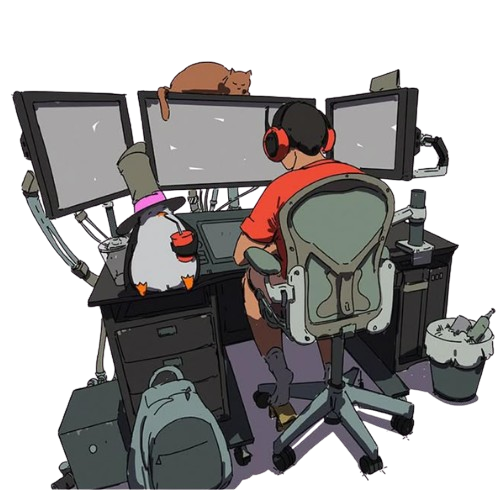

 

 
 

Hello! 👋 I'm Gabriel, a Brazilian Full-Stack Developer.
 

Check out my work & connect:

  <a href="https://comunit-folio.web.app/" target="_blank">Website</a> • 
  <a href="https://www.linkedin.com/in/gabriel-nascimento-gama-5b0b30185/" target="_blank">LinkedIn</a> •
  <a href="[YOUR_TWITTER_LINK_HERE]" target="_blank">Twitter</a>

 

-= My apps and tools =-

  
  

📊 Click to expand GitHub Statistics

 

  
My other projects and repo

   

**Handbook** | **Homepage** | **Stars** | **Downloads**
:--- | --- | :--- | :---
[awesome-readme](https://github.com/GabrielBaiano/awesome-readme) | — |  | 

